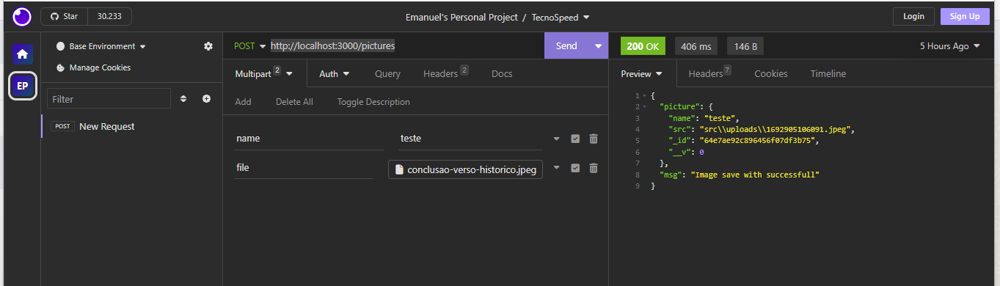

# Image Upload API

This project is an API built with Node.js + Express that enables image uploads to a server. Additionally, the project connects to a MongoDB database, saving the name provided in the request along with the image's path within the server.

## Technologies

    - Nodejs
    - Multer
    - Mongoose
    - Yarn
    - Git 
    - Express

## Requirements
    - NodeJS
    - Yarn or Npm
    - You must have an active MongoDB database

## Get Started
```bash
1 - In the .env file, insert your connection string # MONGO_URI=yourmongodbURI
$  yarn # or 'npm i' - Install all dependencies
$  yarn start  # Run the project

# Use an Api Client to test the application, by default it will run at the following path: http://localhost:3000/pictures
# Perform a POST request, sending the name and image file you want
# The following is an example using the insomnia software
```
<p align="center">
  <a href="http://nestjs.com/" target="blank"></a>
</p>


Once the request is made, navigate to the src/uploads directory of your project, and you will see the image sent in the request
